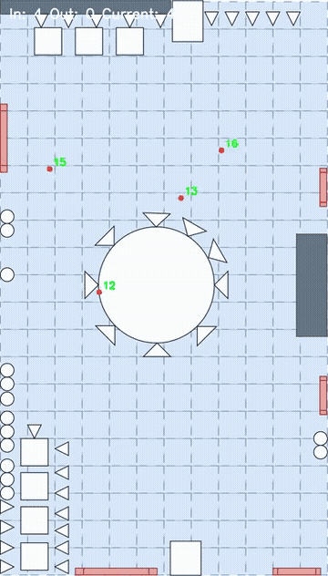
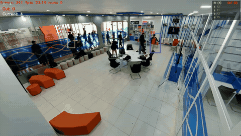

# DAT Lab Management

<p align="center">
  <b>Real-time Edge AI laboratory monitoring with tracking, counting, 2D mapping, analytics, and dashboard visualization.</b>
</p>

<p align="center">
  
  
  
  
  
</p>

DAT Lab Management is a real-time laboratory monitoring system that combines Edge AI, a Django backend, and a Next.js dashboard. The platform detects and tracks people from camera/video streams, counts entries and exits, maps tracked positions onto a 2D floor plan, and visualizes live occupancy and analytics data for lab management.

## ✨ Core Features

- 🎯 **Real-time person detection and tracking** using YOLOX and OCSort.
- 🚪 **Entry and exit counting** based on configurable counting lines.
- 📊 **Live occupancy monitoring** with current people count, FPS, and alert status.
- 🗺️ **2D floor-plan mapping** that projects tracked people from camera coordinates onto a calibrated map.
- 🔌 **Real-time metadata streaming** from the Edge AI pipeline to the backend and frontend through WebSocket.
- 📈 **Analytics dashboard** for occupancy trends, traffic statistics, heatmaps, flow ratios, peak occupancy, and CSV export.
- ⚙️ **Calibration settings** for updating mapping points and counting-line configuration from the web interface.
- 🎥 **Optional WebRTC video streaming** through Janus Gateway for live camera playback.
- 🚀 **Jetson-ready AI deployment** with Docker/TensorRT-oriented support for edge inference.
- ⚡ **Real-time Jetson Nano 8GB deployment** currently available on the `aicore/optimize_tracking/deploy_jetson` branch.

## 🧭 High-Level Architecture

```text
Camera / Video
     |
     v
AI Core
- YOLOX detection
- OCSort tracking
- Counting service
- 2D mapping service
     |
     | WebSocket metadata
     v
Backend
- Django REST API
- Django Channels WebSocket server
- Celery background persistence
- PostgreSQL / SQLite storage
     |
     v
Frontend
- Next.js dashboard
- Live monitoring
- Analytics
- Settings and calibration
```

## 📁 Project Structure

```text
.
├── ai_core/    # Edge AI pipeline, tracking, counting, mapping, and deployment utilities
├── backend/    # Django backend, WebSocket consumers, REST APIs, Celery tasks, and database models
└── frontend/   # Next.js dashboard, live view, analytics pages, settings, and UI components
```

## 🎬 Demo Videos

The repository includes lightweight GIF previews for quick viewing in the README, with links to the full compressed videos.

### Mapping Demo

Demonstrates 2D floor-plan mapping and projected tracking results.



[▶ Watch full mapping demo](ai_core/videos/result_map_compressed.mp4)

### Full System Demo

Demonstrates the full workflow, including people detection, tracking, counting, occupancy monitoring, and dashboard visualization.



[▶ Watch full system demo](ai_core/videos/result_demo_compressed.mp4)

## 🛠️ Technology Stack

### 🧠 AI Core

<p>
  
  
  
  
  
  
</p>

- YOLOX for object detection.
- OCSort for multi-object tracking.
- OpenCV and NumPy for video/frame processing.
- Pydantic and websocket-client for structured metadata streaming.
- ONNX, ONNX Runtime, and TensorRT for optimized edge deployment.
- Docker support for NVIDIA/Jetson environments.

### 🖥️ Backend

<p>
  
  
  
  
  
</p>

- Django 4.2 and Django REST Framework for APIs.
- Django Channels and Daphne for WebSocket/ASGI communication.
- Celery and Redis for background persistence workflows.
- PostgreSQL/Supabase for production storage.
- SQLite fallback for local development.
- WhiteNoise for static file serving.

### 🌐 Frontend

<p>
  
  
  
  
  
</p>

- Next.js 16 and React 19 for the dashboard application.
- TypeScript for typed frontend development.
- Tailwind CSS 4 for styling.
- Zustand for real-time dashboard state management.
- Recharts for analytics visualization.
- jsPDF and html-to-image for reporting/export workflows.
- WebSocket client for live metadata updates.
- Optional Janus WebRTC integration for live camera playback.

## 🔄 Main Data Flow

1. The AI Core reads camera/video frames and runs detection, tracking, counting, and 2D mapping.
2. The AI Core sends frame metadata to the backend through WebSocket.
3. The backend validates, broadcasts, and optionally persists the metadata.
4. The frontend receives real-time updates and renders the live dashboard, floor-plan markers, alerts, and analytics.

## 🧩 Main Modules

### `ai_core`

Responsible for edge-side computer vision processing:

- Person detection
- Multi-object tracking
- Counting line logic
- Coordinate mapping to a 2D floor plan
- WebSocket publishing to the backend
- ONNX/TensorRT deployment utilities

### `backend`

Acts as the central communication and persistence layer:

- Receives real-time metadata from edge devices
- Broadcasts metadata to connected dashboard clients
- Stores frame and object-detection data
- Provides REST APIs for settings and analytics
- Supports Redis and Celery for production workflows

### `frontend`

Provides the user-facing monitoring interface:

- Live camera/dashboard view
- Occupancy metrics
- Alert level display
- Floor-plan visualization
- Analytics charts
- Mapping and counting calibration UI

## ⚙️ Runtime Configuration Overview

Common environment variables include:

```env
# Frontend
NEXT_PUBLIC_API_BASE=http://localhost:8000
NEXT_PUBLIC_JANUS_URL=
NEXT_PUBLIC_JANUS_MOUNTPOINT=1

# AI Core
RESULTS_WS_URL=ws://localhost:8000/ws/persist/metadata/
MAPPING_SETTINGS_WS_URL=ws://localhost:8000/ws/settings/mapping/
COUNTING_SETTINGS_WS_URL=ws://localhost:8000/ws/settings/counting/
API_BEARER_TOKEN=
```

## 🔌 WebSocket Endpoints

| Endpoint | Purpose |
| --- | --- |
| `/ws/persist/metadata/` | Receives AI metadata and broadcasts it to frontend clients |
| `/ws/settings/mapping/` | Sends mapping calibration updates |
| `/ws/settings/counting/` | Sends counting-line configuration updates |

## 📡 REST API Areas

- Account and user APIs
- Lab management settings APIs
- Analytics summary APIs
- Occupancy trend APIs
- Heatmap APIs
- Traffic and flow-ratio APIs
- CSV export APIs

## 🙏 Acknowledgements

The core tracking component is based on [OC_SORT](https://github.com/noahcao/OC_SORT). We sincerely acknowledge the original authors for their work and contribution to the multi-object tracking community.

## 📝 Notes

- The system is designed for an edge-to-cloud/dashboard workflow.
- The AI pipeline can run locally or on NVIDIA Jetson-class devices.
- The optimized Jetson deployment has been tested in real time on Jetson Nano 8GB on branch `aicore/optimize_tracking/deploy_jetson`.
- The backend can use SQLite for development or PostgreSQL/Supabase for production.
- WebSocket metadata and WebRTC video are separate streams: metadata drives dashboard state, while Janus WebRTC can provide live camera playback.
