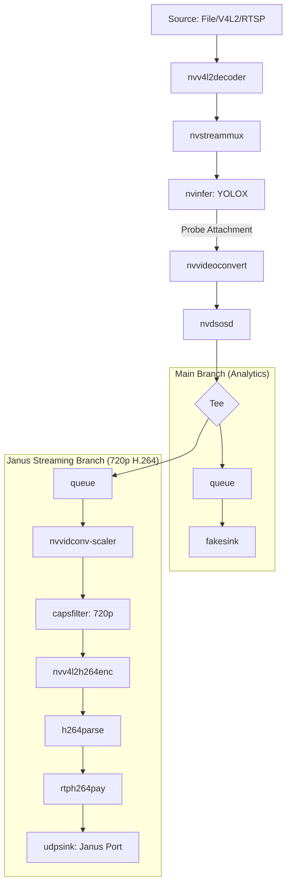

# PipelineManager: Multi-Branch DeepStream Orchestrator

## 1. Responsibilities
- **Multi-Branch Architecture**: Manages a complex pipeline with a main analytics branch and a streaming branch.
- **Hardware-Accelerated Scaling & Encoding**: Scales the stream to 720p and encodes to H.264 using Jetson's NVENC.
- **RTP/UDP Streaming**: Transmits the live processed video with OSD overlays to a Janus Gateway.
- **Service Lifecycle**: Handles `start()`, `stop()`, and graceful signal management (SIGINT/SIGTERM).

## 2. Pipeline Structure


## 3. Janus Branch Configuration
The Janus branch is designed for high-performance low-latency streaming:
- **Scaling**: Downscales to 1280x720 to reduce network bandwidth.
- **Encoder**: `nvv4l2h264enc` with a target bitrate of 4Mbps.
- **Protocol**: RTP over UDP, compatible with Janus/WebRTC streaming plugins.

## 4. Key Implementation Details
- **`_link` Helper**: Used to connect elements with strict error checking to prevent silent link failures.
- **Dynamic Linking**: Supports `qtdemux` for MP4/RTSP files via the `pad-added` signal.
- **Environment Variables**:
    - `JANUS_HOST`: IP address of the Janus server.
    - `JANUS_PORT`: Target UDP port.

## 5. Usage Example

```python
from services.pipeline.manager import PipelineManager
from services.pipeline.probe import AnalyticsProbe

manager = PipelineManager()
manager.build_pipeline(
    source_uri="rtsp://...",
    config_infer="config/config_infer.txt"
)

# Attach logic
probe = AnalyticsProbe(...)
manager.attach_probe(probe)

# Run
manager.run()
```
