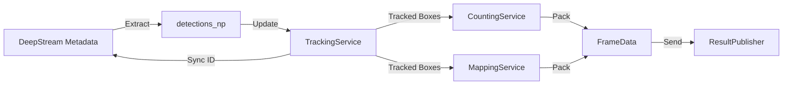

# AnalyticsProbe: Metadata Orchestrator

## 1. Responsibilities
- **Metadata Extraction**: Traverses `NvDsBatchMeta` using `pyds`.
- **Logic Coordination**: Sequentially calls:
    1. `TrackingService.update()` (OCSort)
    2. `CountingService.update()` (Line Crossing)
    3. `MappingService.project_bboxes()` (Homography)
- **Metadata Synchronization**: Updates `NvDsObjectMeta` with OCSort Track IDs so `nvdsosd` draws the correct labels.
- **Visual Injection**: Adds `NvDsDisplayMeta` for the counting line and statistical overlays (In/Out count).
- **Communication**: Publishes final results via `ResultPublisher`.

## 2. Data Flow

## 3. Visual Parity (matching legacy)
- **Bounding Boxes**: Replicates the "Zeno's Dichotomy" palette logic for high-contrast ID colors.
- **Lines**: Draws the magenta counting line directly onto the GPU buffer using `NvDsDisplayMeta`.
- **Text**: Overlays occupancy statistics at the top-left of the frame.

## 4. Performance Optimization
- **Numpy Processing**: Detection extraction and service updates use Numpy arrays for speed.
- **In-Place Sync**: Directly modifies `NvDsObjectMeta` to avoid redundant object searches.
- **Non-Blocking**: Designed to be injected into a non-blocking GStreamer pad probe.

## 5. Thresholds
The alert status (info, warning, critical) is calculated per-frame based on the `occupancy` (count_in - count_out) against user-defined thresholds.
